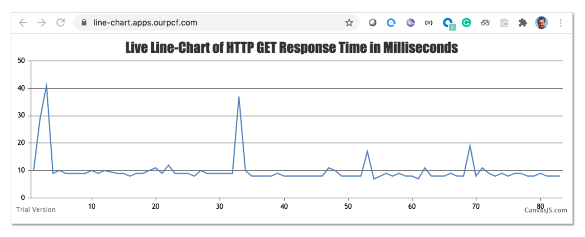

# cutemp raison d'être

`cutemp = curl + tempo`, the idea is to be able to pass a URL to `cutemp` and get back, in json format, the number of milliseconds it took to `curl` said URL. My ultimate goal was to create a Web Page that would show a continuously updated line-chart of the response time for a given URL, and `cutemp` is half of the solution.

Example:

```
$ curl cutemp.apps.ourpcf.com/www.vmware.com

[[2,26.831884]]

$ curl cutemp.apps.ourpcf.com/user1-fact.apps.ourpcf.com/10000

[[3,10.078029]]
```

When used in conjunction with http://github.com/rm511130/line-chart you get:



# Easy to cf push

You can `cf push`  cutemp to any Tanzu Application Services platform as shown in the example below:

```
cf login -a api.sys.ourpcf.com -u rm511130 -p p@55w0rd
cf push cutemp
```

